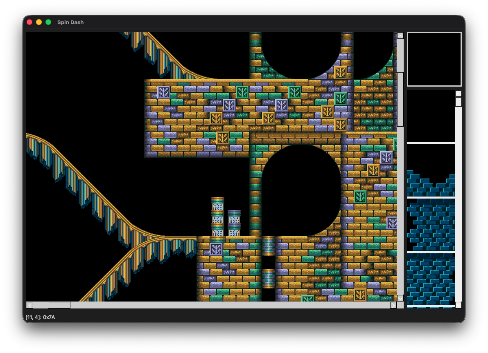
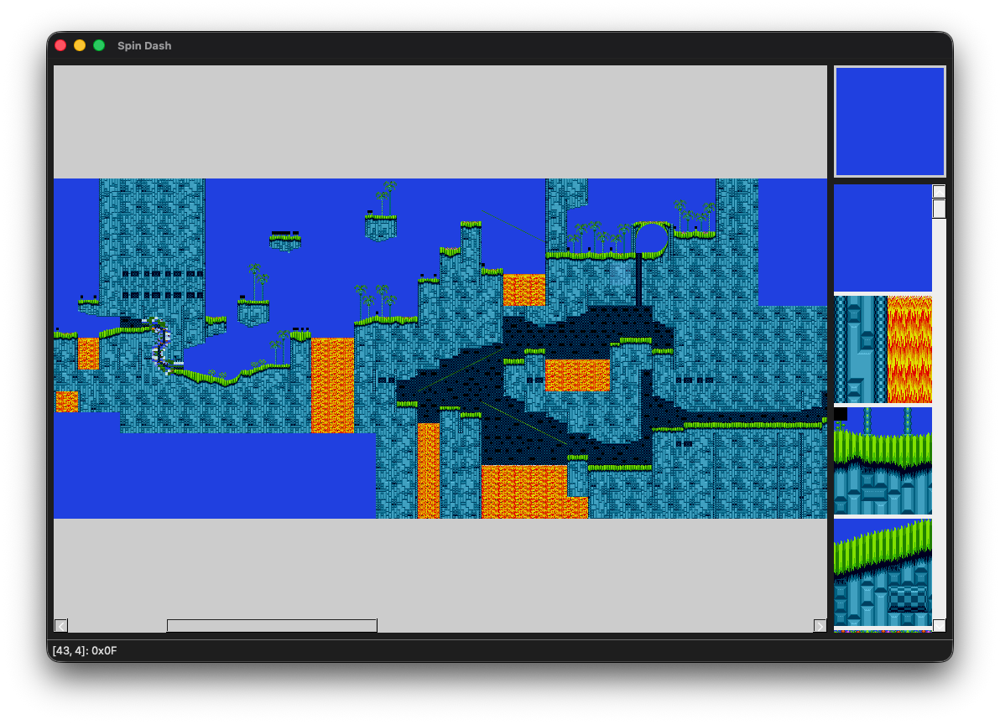
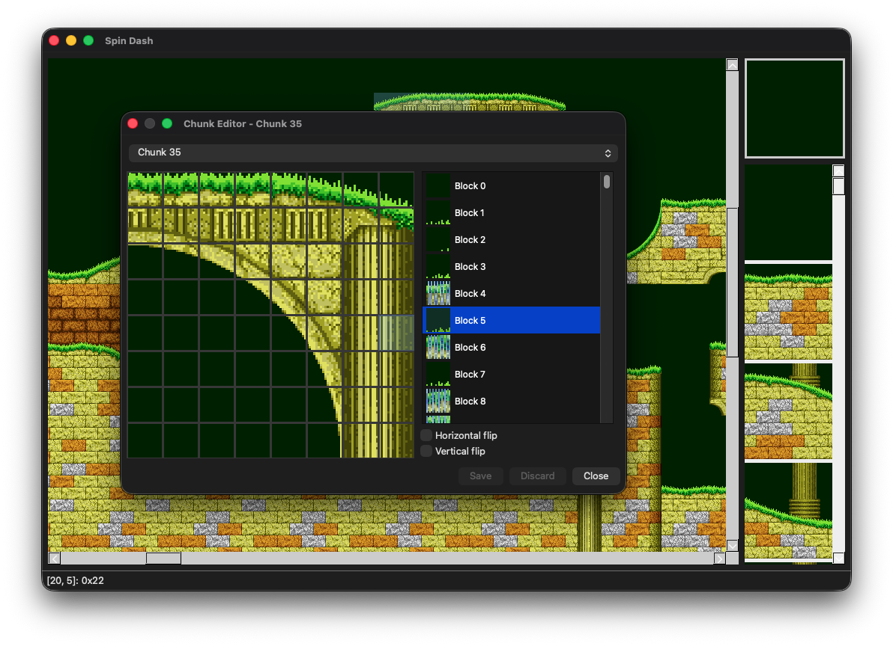

# _SpinDash_

A level editor for Sonic The Hedgehog on Sega Mega Drive and Genesis.

## Background

This project began as a C++ port of Brett Kosinski's [Chaos](https://github.com/fancypantalons/chaos) level editor, which allowed modification of levels directly within a Sonic The Hedgehog 2 ROM file. It can also be used to view levels from Sonic The Hedgehog 3 ROMs:

## Features

Levels can also be zoomed in and out while editing:

_SpinDash_ also includes tile editors for the 8x8 VDP tiles (patterns), 16x16 blocks, and 128x128 blocks used in both Sonic the Hedgehog 2 and 3:

## Dependencies

Building _SpinDash_ requires Qt 5 or 6 development tools to be installed, as well as CMake.

On Ubuntu:

    sudo apt install qt6-base-dev cmake

You may also need to install these two libraries. Without these, QtWidgets may not be found:

    sudo apt install libgl1-mesa-dev libglvnd-dev

On macOS, CMake and Qt can be installed using [homebrew](https://brew.sh/):

    brew install cmake qt

## Build

Once you have Qt and CMake installed, the basic build steps are as follows:

    git clone --recurse-submodules https://github.com/tristanpenman/spindash.git
    cd spindash
    mkdir build
    cd build
    cmake ..
    make

This will compile both the main application and a test suite.

On macOS, this will build an application bundle called `SpinDash.app`. The test suite is a single binary called `SpinDashTest`.

## Documentation

### Kosinski compression

Included in the [doc](./doc) directory is Brett Kosinski's [write up](./doc/kosinski.txt) of the compression algorithm used for level and tile data. This can also be found online [here](https://b-ark.ca/Sonic_2_Compression_Scheme).

### Nemesis compression

The other compression algorithm commonly used in Sonic The Hedgehog games on Mega Drive and Genesis is [Nemesis compression](https://segaretro.org/Nemesis_compression), named after the individual who first reverse engineered it.

## License

This code is licensed under the MIT License.

See the LICENSE file for more information.
